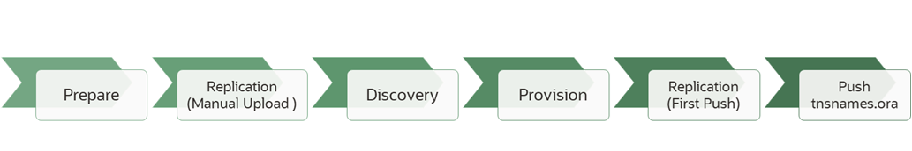

Copyright (c) 2025 Oracle and/or its affiliates
Licensed under the Universal Permissive License v 1.0 as shown at https://oss.oracle.com/licenses/upl/

WLS_HYDR FRAMEWORK
==================================================
This framework **creates and configures a symmetric Disaster Recovery system in Oracle's Cloud (Oracle Cloud Infrastructure-OCI)** for an existing Oracle WebLogic (WLS) or Fusion Middleware (FMW) domain environment. The framework automates the manual procedures described in these playbooks:
- https://docs.oracle.com/en/solutions/weblogic-server-dr-on-cloud/index.html 
- https://docs.oracle.com/en/solutions/soa-dr-on-cloud/index.html

It offers its greatest degree of automation for the cases where the primary environment follows the[ Enterprise Deployment Guide (EDG)](https://docs.oracle.com/en/middleware/fusion-middleware/12.2.1.4/soedg/enterprise-deployment-overview.html) best practices, but also supports many other different topologies.

What the framework **DOES**:
-   It creates and configures a secondary environment in OCI (the compute instances for the mid-tier and the web-tier, the OCI Load Balancer, the private and shared storage artifacts, the network resources, etc.), based on a combination of user inputs and information automatically discovered from the  primary system. To get the complete list of the resources that this framework creates, see [LIST OF THE RESOURCES](#list-of-the-resources). 

-   It copies binaries and configuration (Oracle products' installations, Oracle HTTP Server and Oracle WebLogic domain configuration) from the primary hosts to the OCI compute instances.

-   It translates primary datasources' connect strings to secondary datasources' connect strings (based on TNS alias).

-   It prepares the system for an ongoing replication of configuration and binaries (with different cycles as needed) so that the primary and secondary systems evolve as exact mirrors of each other.

What the framework **DOES NOT DO**:
-   It doesn’t configure connectivity between the primary system and the OCI one (typically a FastConnect link, a VPN or a Peered Gateway).

-   It doesn’t create the secondary system's database in OCI (does not configures Oracle Data Guard between the primary and the OCI database or performs a Data Pump export-import implicitly). Since the Database can be shared by multiple midtier systems, a separate framework is provided for that tier.

    - To create a copy of the database used by WLS/FMW using an Oracle Data Guard standby, please refer to https://docs.oracle.com/en/solutions/configure-standby-db/index.html. This approach requires continuous connectivity between primary and secondary.

    - To create a copy of the database used by WLS/FMW using Oracle Data Pump Export and Import utilities, refer to the scripts at https://github.com/oracle-samples/maa/tree/main/fmw_schemas_exp_imp This approach does not require continuous connectivity between primary and secondary.

This framework can be used in different scenarios:

 - **COMPLETE DR SETUP**: This is the main use case addressed by the framework. In this scenario the framework is used to create a continuously mirrored system for an existing primary WLS/FMW domain. Connectivity between primary and OCI is required. Periodic replication is setup to maintain both systems in sync. In this scenario, the database uses Oracle Data Guard for continuous synchronization of the DB tier. 

 - **BACKUP AND RESTORE TO OCI**: In this scenario, a WLS or FMW domain is restored (or migrated) to OCI from a backup. In this use case, continuous connectivity between the primary datacenter and OCI is **NOT** needed. You upload the binary and configuration contents from primary to a bastion node in OCI. The OCI resources are created based on this information and the required input properties provided in the framework's configuration files. The RTO and RPO of this solution is considerably worse than in the "COMPLETE DR SETUP" case. When using this "backup and restore" approach, Oracle recommends that the secondary system is created and tested on a regular basis. However, and to reduce costs, it is also possible to "leave" the backup in the bastion and use it only when a restore is required (hence not incurring in the additional costs of having resources created and running upfront). In this scenario, the database uses Oracle Data Pump for exporting and importing the data used by WLS/FMW in the DB tier.

- **INFRASTRUCTURE CREATION**: The framework can also be used to create the infrastructure required by a WebLogic environment in OCI (Load Balancer, Compute instances, shared storage, network, security rules etc.) without a primary system as a reference. In this use case, there is no discovery of resources from a primary system: you provide all the required input properties to create the OCI resources that a highly available WebLogic domain typically uses. There is no replication phase, since there is no primary system. You run the framework to create infrastructure resources in OCI, then install Oracle products and configure the WebLogic or FMW domain manually. In this use case, the WLS_HYDR framework only creates the  OCI artifacts that you need for a WebLogic EDG-like system in OCI: compute instances for WebLogic and for OHS, storage artifacts, OCI Load Balancer, network infrastructure and security rules for the subnets in the VCN.

## Topology Diagram
The following diagram shows a typical Hybrid Disaster Recover topology for an Oracle WebLogic Server or Oracle Fusion Middleware system.
 

This framework provisions and configures the components highlighted in green. 

A **bastion node** is used in Oracle's Cloud to run the framework. When used for the "COMPLETE DR SETUP", the bastion connects to primary and creates the secondary system. It then replicates primary's configuration and binaries to the secondary. In the "BACKUP AND RESTORE TO OCI" use case, the bastion receives a "copy" of the artifacts from the primary system in a precise directory structure. It then creates the secondary system using information in this copy. In the "INFRASTRUCTURE CREATION" scenario, the bastion is used simply to initiate and orchestrate the creation of resources in Oracle's Cloud.


> (*) FastConnect provides a dedicated connection between an on-premises data center and Oracle Cloud Infrastructure and is the preferred connectivity solution for Oracle Data Guard between an on-premises Oracle Database and the OCI standby database. Alternatively, you can use Site-to-Site VPN as long as it meets the bandwidth and latency needs for the WLS/FMW domain and database replication.  
> The tool uses this connectivity to establish a SSH connections from the bastion host to the primary hosts both in the initial setup and for the ongoing replication of binaries and configuration.
> As explained, in the "BACKUP AND RESTORE TO OCI" and "INFRASTRUCTURE CREATION" scenarios, it is not required to establish a FastConnect or Site-to-Site VPN connection. In these cases, you use this tool (without connectivity to primary) to replicate from a copy in the bastion host or just to create resources in OCI.

## Preparation and Requirements
Your system must meet the following requirements to use the WLS_HYDR framework in all its different uses cases ("COMPLETE DR SETUP", "BACKUP AND RECOVERY TO OCI" and "INFRASTRUCTURE CREATION"):

-   A compartment in your OCI tenancy must exist already.
-   A Virtual Cloud Network (VCN) for the OCI resources must exist already. It is expected (but not mandatory) that, if the system uses a database, the database will be in the same VCN and set up before the midtier (if the WLS domain uses JDBC persistent stores, the database must be available before the secondary domain is started).
-   An OCI Linux (OL8 or OL9) bastion host must exist in the same VCN as the OCI secondary system. Alternatively, if the bastion host isn’t located in the same VCN as the secondary's OCI resources, OCI's VCN local peering must be configured in advance between the bastion's VCN and the secondary system's VCN  (refer to the [OCI documentation](https://docs.oracle.com/en-us/iaas/Content/Network/Tasks/VCNpeering.htm) for this operation). 
-   The Operating System versions supported for the primary hosts in the current framework's version are OL7.X, OL8.x, RHEL7.x and RHEL8.x. If the primary hosts are OL7 or RHEL7, then the compute instances in OCI will be created with OL7 image. If the primary hosts are OL8 or RHEL8, then the compute instances in OCI will be created with OL8 image.
-   By default and following the Enterprise Deployment Guide best practices, Oracle HTTP Servers (OHS) are used to route requests to the WebLogic Servers. If OHS is not used, the framework can be configured to skip its configuration.
-   A Load Balancer (LBR) is used in front of the OHS hosts. It is expected that this LBR uses a SSL listener for the exposed applications. It's SSL certificate (public and private key files) must be available and transferred to the bastion node (will be used to configure the OCI load balancer).
-   At least 2 nodes for OHS and 2 nodes for WLS are used in primary (minimum High Availability). 
-   This framework cannot be used to setup asymmetric DR topologies. It will always set up in secondary the same number of nodes as in primary.
-   The components (WebLogic Servers, OHS instances) do not use IPs as listen addresses. All listeners in any of the components use standard hostnames and not IPs.
-   The system is accessed using frontend host names (a.k.a vanity urls). This means the WebLogic applications are accessed through the Load Balancer Virtual Server host names and not IPs.
-   If the WebLogic domain uses an Oracle Database, the appropriate database needs to be "replicated" in OCI: 
    - For the "COMPLETE DR SETUP" Data Guard should be configured before or after running this framework. Refer to the steps at https://docs.oracle.com/en/solutions/configure-standby-db/index.html. Notice that this WLS_HYDR framework creates the required security rules for accessing the Database subnet but, if the database is in a different VCN, it does not set up the required [Local Peering Gateway](https://docs.oracle.com/en-us/iaas/Content/Network/Tasks/localVCNpeering.htm) between these tiers. 
    - Alternatively and for the "Backup and Restore to OCI" use case, a separate Oracle Data Pump Export and Import framework can be used for the JRF/FMW schemas (refer to https://github.com/oracle-samples/maa/tree/main/fmw_schemas_exp_imp)

Additionally to these requirements, applicable to all the use cases, in the "COMPLETE DR SETUP" use case, connectivity is required between the OCI bastion host and the primary hosts:
-   On-premises and OCI networks can be interconnected with [Oracle Cloud Infrastructure FastConnect](https://docs.oracle.com/en-us/iaas/Content/Network/Concepts/fastconnectoverview.htm#FastConnect_Overview) (preferred) or Site-to-Site VPN. In an "OCI to OCI" setup, [remote peering](https://docs.oracle.com/en-us/iaas/Content/Network/Tasks/scenario_e.htm#scenario_e) between the two systems has to be configured.
-   Direct SSH access is required from the bastion host to the primary OHS and WLS hosts using the owner OS user (e.g. "oracle"). The SSH authentication must use an SSH key. Password-based Authentication is not supported by the framework. 


## Default Configuration Assumptions
In it's default configuration the WLS_HYDR framework assumes that:
-   SSL is terminated in the front end Load Balancer.
-   The OHS servers use one virtual host for external access (on SSL) to the applications exposed by the WLS domain.
-   (Optional) The OHS servers use a dedicated virtual host for HTTP access to the WLS Admin console.
-   (Optional) The OHS servers use an additional virtual host for HTTP internal access (for example to access Web Services Manager or other sub-systems that are not exposed to the public internet).
-   The OHS virtual host configuration resides under the "ohs_instance_config/moduleconf" folder.
-   In the "COMPLETE DR SETUP" use case, the same SSH key is used to connect to all the on-premises OHS nodes with the user that owns the OHS installation (e.g. "oracle").
-   In the "COMPLETE DR SETUP" use case, the same SSH key is used to connect to all the on-premises WLS nodes with the user that owns the WLS/FMW installation  (e.g. "oracle").
-   Every WebLogic Server, including the Admin Server, uses a precise hostname as listen address. This means the listen address is not blank nor an IP.
-   There is a single WebLogic Managed Servers' listen address per host in the WebLogic domain. This address may resolve to a different IP from the one provided for the SSH access. I.e. all WebLogic Managed servers in node "A" in a domain use the same hostname for their listen addresses (different port). The Admin Server, however, can listen on an additional virtual hostname (VHN mapping to a VIP). This is the recommended approach for and Enterprise Deployment (where the Admin Server can failover across nodes in the domain). These VHN and VIP must be manually configured in secondary after running the framework.
-   The nodes in the WebLogic domain have access to the domain shared config folder (used to failover the Admin Server).
-   There is one WebLogic domain configuration folder private to each WebLogic host. This directory does not reside directly in the boot volume /. Using the boot volume in primary for storing the domain config is supported by the framework also, although not recommended. Refer to [ABOUT TOPOLOGY VARIATIONS](#about-topology-variations). Each private domain configuration folder can be an NFS private mount or a Block Volume, mounted individually in each host in the WLS domain.
-   The Oracle products installations in the WebLogic hosts do not reside in the boot volume /. Using boot volume in primary for storing binaries is supported by the framework also, although not recommended. Refer to [ABOUT TOPOLOGY VARIATIONS](#about-topology-variations). By default, the WLS_HYDR framework assumes that there are 2 redundant shared binary homes (NFS) in primary: one mounted by half of the nodes and the other mounted by the other half. This is the configuration recommended by the Enterprise Deployment Guide and is also the storage topology that is created in OCI.
-   A TNS alias is used in the database connection strings of the primary WebLogic's datasources. TNS alias can be configured before the execution of the Hybrid DR framework. Using TNS alias is recommended even without DR in the picture. Refer to Database Considerations in the Oracle FMW DR Guide for details (https://docs.oracle.com/en/middleware/fusion-middleware/12.2.1.4/asdrg/setting-and-managing-disaster-recovery-sites.html#GUID-445693AB-B592-4E11-9B44-A208444B75F2)
-   The WebLogic Administration Server runs collocated with managed servers in one of the hosts.

See the section below [ABOUT TOPOLOGY VARIATIONS](#about-topology-variations) for non-default configurations and how to use this framework with them.

Users and roles required
--------------------------------------
This solution requires the following services and roles:

| Service Name: Role                             | Required to...                                                                                                                                         |
|------------------------------------------------|--------------------------------------------------------------------------------------------------------------------------------------------------------|
| Oracle Cloud Infrastructure: administrator     | Create the required resources in the OCI tenancy with the tool (compute instances, storage, Load Balancer, networking resources)                       |
| Network: administrator                         | Configure the required network resources both in on-premises and OCI: Fast Connect, VCNs and subnets in OCI, network security rules and routing rules. |
| Oracle WebLogic Server: root, oracle           | Use the tool to configure the secondary hosts: OS level configuration, add host aliases, mount file systems, and replication.    |
| Oracle WebLogic Server: WebLogic Administrator | Manage Oracle WebLogic Server: stop, start, and apply WebLogic configuration changes.                                                                  |
| Oracle HTTP Server: root, oracle               | Use the tool to configure the secondary OHS hosts: perform the OS level configuration, add host aliases, mount file systems, and replication.    |

FRAMEWORK OVERVIEW
==================================================
The WLS_HYDR framework consists of three main components 

 

This tree diagram shows the most relevant files in the framework:  

|What|Description
|---|---|
|wls-hydr|Basedir|
|├── config|Directory where configuration files are saved|
|├── lib|Lib directory where submodules and template files are located|
|│──├──DataReplication.py|Script used to replicate configuration and binaries|
|│──├──Discovery.py|Script used to introspect the configuration of the primary system|
|├── log|Directory containing the execution logs|
|└── wls_hydr.py|Provisioning script|
|└── wls_full_setup.py |Overall orchestrator script (invokes DataReplication, Discovery and Provisioning)|

The wls_full_setup.py is used as an orchestrator script for the Replication, Discovery and Provisioning modules above. It ties their execution in one single step.

END-TO-END PROCEDURES DESCRIPTION
==================================================
- **COMPLETE DR SETUP**: The following diagram summarizes the **main flow execution** of the framework. This procedure creates a secondary system in OCI for a given primary (ideally, based on the EDG best practices). The entire process can be completed executing the orchestrator script (wls_full_setup.py). Alternatively, each individual phase can be run separately with the scripts provided (DataReplication.py, Discovery.py and wls_hydr.py). Note, however, that the execution of each phase depends on the results of the previous one.


- **BACKUP AND RESTORE TO OCI**: This procedure can be used when there is no connectivity between OCI bastion and primary's hosts. You don't run the Replication (pull) phase with the tool in this case. Instead, you upload the contents from primary to the bastion manually (through a secure copy). You can transfer them in a single tar file but then need to place them in a precise directory structure so that the framework can interpret contents properly. The entire process can be completed with executing the orchestrator script (wls_full_setup.py) with the "no connectivity" option. Alternatively, each individual phase can be run separately with the scripts provided (DataReplication.py, Discovery.py and wls_hydr.py)l. This use case can be viewed as an automated restore from a backup transferred to the bastion.



- **INFRASTRUCTURE CREATION**: In this case the framework is used only to create the resources in OCI without having a primary environment as a reference. You only prepare the bastion and run the provisioning phase. This creates the typical components required by a Highly Available topology like the EDG. Then, you manually install Oracle products and configure a new WebLogic domain using the OCI infrastructure created.


## Prepare the system
Run the following steps as preparation for the execution of the scripts in all scenarios:

1. Create the Virtual Cloud Network (VCN) for the resources in OCI in the region where you want to create the resources.
2. Create a subnet in the VCN for the bastion. 
3. Provision a bastion host in the subnet. The bastion host must use OL8 or OL9. A "VM.Standard.E4.Flex with 1 OCPU and 16GB memory" shape is enough to run the framework. The amount of information that is copied to the bastion can be high (around 40GB for the typical FMW SOA product and config directories), so you can attach an additional block volume of this size during the bastion creation process itself. You can use this formula for a rough estimate of the required storage size: _[2xFMW products] + [WLS_domain_size x (nº wls nodes + 1)] + [2xOHS products] + [OHS domain_size x (nº of OHS nodes)]_
4. For the "COMPLETE DR SETUP" use case, setup connectivity between primary hosts and the bastion host (FastConnect, VPN, Peering). This is not required if you are performing a "BACKUP AND RESTORE TO OCI".
5. Prepare the bastion host to run the framework:
    1. Make sure the following python modules are installed:  
    oci sdk (this package should come pre-installed on OCI OL9 images):  `rpm -qa | grep -i python.*oci `   
    paramiko:     `rpm -qa | grep -i python3-paramiko`   
    Install with the following command if missing:  
    `sudo yum --enablerepo="ol9_developer_EPEL" install python3-paramiko`  
    or  
    `sudo yum --enablerepo="ol8_developer_EPEL" install python3-paramiko`
    2. Add the OCI config to the bastion server. This is needed to connect through OCI APIs to the OCI tenancy and region where you want to create the resources. The complete instructions can be found [here](https://docs.oracle.com/en-us/iaas/Content/API/Concepts/apisigningkey.htm#apisigningkey_topic_How_to_Generate_an_API_Signing_Key_Console). Then, when you run the provisioning phase, you can supply the path of the oci config file using -c/--oci-config FILE_PATH. If no path is supplied, the default path is assumed `<HOME>/.oci/config` 
7. Download the WLS_HYDR framework to the bastion server (example location <HOME>/wls_hydr) 
8. (Optional) Create a subnet for the database if the WLS/FMW domain is using one.
9. (Optional) Create a peer DB system if the WLS domain is using one:
    - For the "COMPLETE DR SETUP" Data Guard should be configured before or after running the WLS_HYDR framework. Refer to the steps at https://docs.oracle.com/en/solutions/configure-standby-db/index.html. The WLS_HYDR framework does not set up connectivity between the middle tier and the database in OCI. 
    - Alternatively, and for the "BACKUP AND RESTORE TO OCI" use case, an automated Oracle Data Pump Export and Import can be used for the JRF/FMW schemas (refer to https://github.com/oracle-samples/maa/tree/main/fmw_schemas_exp_imp).

## Running "COMPLETE DR SETUP"
To run the "COMPLETE DR SETUP" follow these steps:

- Edit the `<WLS-HYDR_BASE>/config/prem.env` file. This file is used to identify nodes and users in the primary system. Provide the values requested (the file contains a description of each entry).

- Edit the `<WLS-HYDR_BASE>/config/replication.properties` file. This file is used to identify the primary system's directories and for configuring replication settings. Provide the values requested (the file contains a description of each entry).

- Transfer the `<WLS-HYDR_BASE>/sysconfig_discovery.xlsx` file to a Windows node to facilitate its edition. Fill in the entries in the excel files marked as "needs custom input". The entries marked as "default value can be used" can be customized or left in their default value.

- Once edited, save the excel as a CSV (Comma delimited) file format (do not use CSV UTF-8, use plain CSV format) and upload it to the bastion again. You can use any file name for the saved copy, the examples provided only use the name XXX_sysconfig_discovery.csv to differentiate use cases.

- Upload to the bastion the SSH keys of the primary nodes. You need to upload both the SSH private and the SSH public key since those will be used also in the new OCI environment. Place them in the appropriate path, according with the inputs in the sysconfig spreadsheet.

- Upload to the bastion the certificate files for the front end Load Balancer. You need to upload both its public certificate and the certificate's private key to the bastion.

- Run the wls_full_setup.py script indicating the sysconfig file that will be used (the csv file created in previous steps). For example:
`<WLS-HYDR_BASE>/./wls_full_setup.py -i sysconfig_discovery.csv`

You will be prompted to make some selections based on the information detected in primary. You can add the -d flag to obtain debugging information through the different steps.

- If your WLS/FMW domain is using a database, use the steps at https://docs.oracle.com/en/solutions/configure-standby-db/index.html to configure an Oracle Data Guard standby in OCI.

## Running "BACKUP AND RESTORE TO OCI"

To perform a "BACKUP AND RESTORE TO OCI", follow these steps:

- Edit the `<WLS-HYDR_BASE>/config/prem.env` file. Even when there is no connectivity to primary, this file is used to identify nodes and users in the primary system. Provide the values requested (the file contains a description of each entry).

- Edit the `<WLS-HYDR_BASE>/config/replication.properties` file. This file is used to identify the primary system's directories and for configuring replication settings. Provide the values requested (the file contains a description of each entry).

- Transfer the `<WLS-HYDR_BASE>/sysconfig_discovery.xlsx` file to a Windows node to facilitate its edition. Fill in the entries in the excel file marked as "needs custom input". The entries marked as "default value can be used" can be customized or left in their default value.

- Once edited, save the excel as a CSV (Comma delimited) file format (do not use CSV UTF-8, use plain CSV format) and upload it to the bastion again. You can use any file name for the saved copy, the examples provided only use the names XXX_sysconfig_discovery.csv to differentiate use cases.

- Upload to the bastion the SSH keys of the primary nodes. You need to upload both the SSH private and the SSH public key since those will be used also in the new OCI environment). Place them in the appropriate path, according with the inputs in the sysconfig spreadsheet.

- Upload to the bastion the certificate files for the front end Load Balancer. You need to upload both its public certificate and the certificate's private key to the bastion.

- Create the stage folder structure in the bastion using the DataReplication.py init command:  
`<WLS-HYDR_BASE>/lib/DataReplication.py init -w <nº wls nodes> -o <nº ohs nodes>`  
This will create the required directory structure to place contents from primary

- Manually upload the contents from the primary system to these folders. Read the file README_FOR_MANUAL_COPY.txt in the stage folder for details about how to copy each item.

- Run the wls_full_setup.py script indicating the sysconfig file that will be used (the csv file created in previous steps) and using the -n option to indicate that there is no connectivity to primary. For example:
`<WLS-HYDR_BASE>/wls_full_setup.py -i sysconfig_discovery.csv -n`

You will be prompted to make some selections based on the information detected in the copy at the bastion. You can add the -d flag to obtain debugging information through the different steps.

- If your WLS/FMW domain is using a database, use the steps at https://github.com/oracle-samples/maa/tree/main/fmw_schemas_exp_imp to run an Oracle Data Pump export from the primary DataBase and an Oracle Data Pump import to an Oracle DataBase in OCI (refer to the export_fmw.sh and import_fmw.sh scripts details).

## Running "INFRASTRUCTURE CREATION"
If you want to use the framework simply to create in OCI the artifacts typically required by a highly available WLS/FMW system (see [LIST OF THE RESOURCES](#list-of-the-resources))  follow these steps:

- Edit the `<WLS-HYDR_BASE>/config/prem.env` file. Even when there is no primary system, this file is used to identify the number of nodes and users that will be created in the OCI system. Provide the values requested (the file contains a description of each entry).

- Transfer the `<WLS-HYDR_BASE>/sysconfig.xlsx` file to a Windows node to facilitate its edition. Fill in the entries in the excel file marked as "needs custom input". The entries marked as "default value can be used" can be customized or left in their default value.

- Once edited, save the excel as a CSV (Comma delimited) file format (do not use CSV UTF-8, use plain CSV format) and upload it to the bastion again. You can use any file name for the saved copy, the examples provided only use the name XXX_sysconfig.csv to differentiate use cases.

- Upload to the bastion the SSH keys that will be used in the OCI nodes . You need to upload both the SSH private and the SSH public key since those will be used in the new OCI environment. Place them in the appropriate path, according with the inputs in the sysconfig spreadsheet.

- Upload to the bastion the certificate files for the front end Load Balancer (that the new system will use). You need to upload both its public certificate and the certificate's private key to the bastion.

- Run the wls_hydr.py script indicating the sysconfig file that will be used (the csv file edited in previous steps). For example:
`<WLS-HYDR_BASE>/wls_hydr.py -i sysconfig.csv`

- If your WLS/FMW domain is using a database, create it in OCI using the standard provisioning procedures for each database type. 

- Once infrastructure is created, you can manually install WLS/FMW/OHS in the compute instances created and configure LBR according to your installation preferences. 

## Log information
The framework provides a log file for the orchestrator script and individual logs for each one of the modules. Check these logs for errors after executing the framework. Logs are located at `<WLS-HYDR_BASE>/log`. Each log is marked with the precise module name and the date of the execution. For example: 

-rw-rw-r--. 1 opc opc 10276372 Feb 18 19:36 replication_2025-02-18_18:45.log

-rw-rw-r--. 1 opc opc     5039 Feb 18 19:36 discovery_2025-02-18_19:36.log

-rw-rw-r--. 1 opc opc    29665 Feb 18 20:02 wls_hydr_2025-02-18_20:01.log

-rw-rw-r--. 1 opc opc      471 Feb 18 20:02 full_setup_2025-02-18_18:45.log


## Cleaning Up Resources after a Provision Operation
The WLS_HYDR framework provides an utility to clean up the resources created in the provisioning phase. This is useful for failed operations or when the secondary system needs to be decommissioned. The clean up script removes the OCI resources listed in the `<WLS-HYDR_BASE>/config/sysconfig_$date.json` file (created when wls_hydr.py is executed) that were marked for possible deletion in the provisioning phase. The framework differentiates between the pre-existing resources, such as the dbsubnet for example, and the newly created ones. Only the resources that were created by the framework are marked for possible deletion. The cleanup script doesn't delete any pre-existing resources. The resources are removed in a precise order to avoid errors caused by dependencies.   

The contents of the sysconfig_$date.json file are updated by the `wls_hydr.py` and `cleanup.py` scripts according to the different operations performed on resources. Do not manually edit/alter the contents of this file.

To clean up resources from a failed execution of the wls_hydr framework or simply to remove a secondary, follow these steps: 

- Prepare for cleanup:
    - Check the existence of the `<WLS-HYDR_BASE>/sysconfig_$date.json` file. It should contain a list of resources with different states depending on the results from previous executions of the WLS_HYDR scripts.
- Run:
    - Execute the cleanup script providing the sysconfig_$date.json file as argument with the -s option:  
    `<WLS-HYDR_BASE>/cleanup.py -s <sysconfig_$date.json>`  
    For example:  
    `<WLS-HYDR_BASE>/cleanup.py -s /u01/config/sysconfig_2024-11-11_11\:46.json`  
    The script will report the state of the different resources and the result of the cleanup operation in the `<WLS-HYDR_BASE>/log/cleanup_$date.log` file.
- Validate results:
    - The `cleanup_$date.log` and the output in the execution shell will report the resources that have been deleted, as well as those that was not possible to delete (because of external dependencies or other errors).
    - Use the OCI console to confirm that resources have been removed. The following is an ordered list of the resources that the cleanup scripts deletes:

        - Compute Instances
        - Block Volumes
        - Exports
        - Mount Targets
        - File Systems
        - Load Balancers
        - Subnets
        - Route Tables
        - Security Lists
        - DHCP Options
        - NAT Gateways
        - Service Gateways
        - Internet Gateways
        - DNS Zones
        - DNS Views
    

# DETAILS ABOUT THE INDIVIDUAL OPERATIONS

Alternatively to using the `wls_full_setup.py` orchestrator script, each one of the modules (Replication, Discovery and Provisioning) can be run separately. The following sections provide details about each module.

## Replication: First Pull or Manual Upload
In the initial replication step, the file system contents from the primary hosts are copied to a stage folder in the bastion host. In the next phases, the tool will introspect this information and push it to the OCI compute instances once they are created. This first copy can be done with the framework if there is connectivity to primary ("COMPLETE DR SETUP") or can be done manually ("BACKUP AND RESTORE TO OCI"). This step is not required for the "INFRASTRUCTURE CREATION" use case.

- Prepare for replication: 
    - Create the stage folder in the bastion. If you don't have enough disk space for the copies, you can create an OCI FSS or a new block volume and mount it on the bastion.
    - Edit the `<WLS-HYDR_BASE>/config/prem.env` file. This file is used to identify nodes and users in the primary system. Provide the values requested (the file contains a description of each entry). 
    > NOTE: Provide the IP values even if there is no connectivity. The tool requires this info to identify the number of nodes in the primary system.
    - Edit the `<WLS-HYDR_BASE>/config/replication.properties` file. This file is used to identify the directories and for configuring replication options. Provide the values requested (the file contains a description of each entry).

#### Replication: First Pull Using the Framework
When there is SSH connectivity from the bastion to the WLS/FMW and OHS primary hosts ("COMPLETE DR SETUP"), use the framework to retrieve the contents from primary using the pull option with the replication script. The contents are placed in a precise directory structure under the stage folder. This stage folder is specified in the `<WLS-HYDR_BASE>/config/replication.properties` file (STAGE_GOLD_COPY_BASE variable)
- Run the replication script:
    - `<WLS-HYDR_BASE>/lib/DataReplication.py pull`
- Validate results:
    - Verify the output log (under wls-hydr/log).
    - Verify that the configuration and binaries directories in primary are present in the bastion's stage folder.

The following table summarizes how each item is copied to the stage folder.

| Item    | Pull | Location of the copy under the STAGE_GOLD_COPY_BASE folder |
| -------- | ------- | ------- |
| OHS_PRODUCTS | Regardless the number of OHS nodes in primary, the DataReplication script retrieves just 2 copies (one copy from OHS node 1 and another copy from OHS node 2). This is done to provide redundancy and minimize storage size.  |  webtier/ohs_products_home/ohs_products_home1 <br>webtier/ohs_products_home/ohs_products_home2  |
| OHS_PRIVATE_CONFIG_DIR   | One copy per OHS node.    |  webtier/ohs_private_config/ohsnodeN_private_config  |
| WLS_PRODUCTS  | Regardless the number of WLS nodes, the DataReplication script retrieves just 2 copies (one from node 1 and other from node 2). This approach provides redundancy and minimizea storage size. It is valid for cases where redundant shared products folders are used and for cases where each node has private products folder |  midtier/wls_products_home/wls_products_home1<br> midtier/wls_products_home/wls_products_home2  |
| WLS_PRIVATE_CONFIG_DIR    | One copy from each WLS node.     |  midtier/wls_private_config/wlsnodeN_private_config/  |
| WLS_SHARED_CONFIG_DIR | It is assumed that this shared folder could contain external content from other environments. So only these subfolders are copied: <br>- the domain home <br>- the applications home (where the em.ear file resides). <br>These items are copied only from the first node, as this is expected to be a shared folder. |  appropriate subfolders under midtier/wls_shared_config/  |
| WLS_SHARED_RUNTIME_DIR    | The content in this folder is not copied. The value is used only to prepare the storage mount in OCI.    |  N/A  |
| WLS_CONFIG_PATH    | The location of the config.xml file. The tool gathers the domain home and applications home from this file    |  N/A  |
| WLS_DP_DIR    | Copied only from the first WLS node. It is assumed this is a shared folder.     |  appropriate subfolder under midtier/wls_shared_config  |
| WLS_ADDITIONAL_SHARED_DIRS    | Additional shared dirs that need to be copied. They are copied from node 1    |  The full path is stored under midtier/wls_shared_config/additional_dirs/  |

#### Replication: Manual Upload
If you don't have SSH connectivity between the bastion and the primary hosts ("BACKUP AND RESTORE OCI"), you have to copy the items to the bastion's stage folder manually. This stage folder is specified in the `<WLS-HYDR_BASE>/config/replication.properties` file (STAGE_GOLD_COPY_BASE variable). The contents need to be placed in precise directories so that the framework can interpret them correctly. Follow these steps to perform a Manual Upload of your WLS/FMW system to the bastion host:

- Create the required WLS/FMW folder structure under the stage directory using this command:  
`<WLS-HYDR_BASE>/lib/DataReplication.py init -w <nº wls nodes> -o <nº ohs nodes>`  
This will create the following directory structure under the stage folder (specified in the replication.properties file):
```
├── midtier  
│   ├── var  
│   │       
│   ├── wls_private_config  
│   │     ├── wlsnode1_private_config  
│   │     ├── wlsnode2_private_config  
│   │     └── (.. N, according to number of WLS nodes in primary)  
│   ├── wls_products_home  
│   │     ├── wls_products_home1  
│   │     └── wls_products_home2  
│   └── wls_shared_config  
│
└── webtier  
    ├── ohs_private_config  
    │     ├── ohsnode1_private_config  
    │     ├── ohsnode2_private_config  
    │     └── (.. N, according to number of OHS nodes in primary)  
    └── ohs_products_home (only two irrespectively of additional OHS nodes)  
          ├── ohs_products_home1  
          └── ohs_products_home2
```
- Manually upload the contents from the primary system to the different folders. Read the file `README_FOR_MANUAL_COPY.txt` in the stage folder for details about how to copy each item.

## Discovery
In the discovery phase, the framework finds relevant information about the primary system. 

- In the "COMPLETE DR SETUP" use case the framework obtains this information by a)introspecting the pulled information, b)connecting via SSH to the primary hosts and c)prompting the user to make just a few selections. 
 
- In the "BACKUP AND RESTORE OCI" use case, the framework introspects the local copy of domain and binaries, the .env files provided and prompts the user for the remaining details.

- This step is not required for the "INFRASTRUCTURE CREATION" use case.

The tool will use the information gathered to create the resources in OCI in the next phases.
- Prepare for discovery:
    - Make sure `<WLS-HYDR_BASE>/config/prem.env` contains the required information. If you ran the pull replication phase for the "COMPLETE DR SETUP", this file should be already customized. If you are running the "BACKUP AND RESTORE OCI" use case, you need to provide the information requested in this file as well, since it is used to determine the required IP mappings as well as the number of nodes etc.
- For the "COMPLETE DR SETUP" run:
    - `<WLS-HYDR_BASE>/lib/Discovery.py`
- For the "BACKUP AND RESTORE OCI" run with "-n" flag, which performs the discovery without connecting to primary hosts:
    - `<WLS-HYDR_BASE>/lib/Discovery.py -n`

Provide the information requested in each case to generate the configuration that will be used to create resources in OCI. The script will ask for details about the configuration in the primary system. Here are some guidelines for the most convoluted options provided:
    
| Prompt   | Details |
| -------- | ------- |
|  OS Version  |  The framework will prompt for selecting a main OS version (for example OL 7 or OL 8). The scripts will use the LATEST OCI image of that OS version to create the corresponding compute instances  |
|  CPU count and memory for Compute Instances  |  Any value between 1 and 114 CPUs can be entered. The memory must be minimum 1 GB per CPU and maximum 64 GB per CPU with a total maximum value of 1776  |
| OHS HTTP port |  This is the port used by the OHS listeners that expose the applications in this WebLogic domain. It may be the case that multiple domains are exposed through a unique OHS cluster. The port specified here is the one that is used by the mounts that expose the applications in the precise WebLogic domain being replicated| 
| LBR virtual hostname |  This is the LBR frontend hostname used to access the applications exposed in this WebLogic domain being replicated. If the WebLogic domain being replicated uses more than one LBR frontend hostname for applications, select here one of them and add the rest hostnames manually in the LBR's OCI Console |

- Validate:
    - The discovery tool stores the introspected results in the output file `<WLS-HYDR_BASE>/config/discovery_results.csv`. You can review the file (ideally in a CSV import from Excel) and check that the entries are correct for your environment.
    - If needed, you can re-run discovery. A backup of the previous discovery_results.csv file is taken a and new discovery_results.csv file will be created.

## Provisioning
In the provisioning phase, the tool creates the resources in OCI. These are created according to the input properties provided by the user and the results obtained in the discovery phase. 
- Prepare for provisioning:
    - If you have run the discovery phase ("COMPLETE DR SETUP" and "BACKUP AND RESTORE OCI"), then you need to complete just a few pending entries (those that are not already populated by discovery) in the excel file _sysconfig_discovery.xlsx_. 
    - If you have NOT run the discovery phase ("INFRASTRUCTURE CREATION" use case), then you need to complete all the entries listed in the excel file  _sysconfig.xlsx_ 
    
    Both file templates (sysconfig_discovery.xlsx and sysconfig.xlsx) reside directly under `<WLS-HYDR_BASE>` (as clones or copied from the GitHub repository). Transfer the file pertaining your use case (discovery or non-discovery) to a Windows node to facilitate its edition. It is mandatory to fill in the entries in the excel files marked as "needs custom input". The entries marked as "default value can be used" can be customized or left in their default value.  

    - Once edited, save the excel as s CSV (Comma delimited) file format (do not use CSV UTF-8, use plain CSV format) and upload it to the bastion again. You can use any file names for the saved copies, the examples provided only use the names _XXX_sysconfig_discovery.csv_ and _XXX_sysconfig.csv_ to differentiate use cases.
   - Upload to the bastion the SSH keys that will be used in the OCI nodes . You need to upload both the SSH private and the SSH public key since those will be used in the new OCI environment. Place them in the appropriate path, according with the inputs in the sysconfig spreadsheet.
   - Upload to the bastion the certificate files for the front end Load Balancer (that the new system will use). You need to upload both its public certificate and the certificate's private key to the bastion.
   - Run the creation of resources:
    - If you have run the discovery phase, execute the main script using the "-a" flag and provide the exported csv file as parameter: 
    `<WLS-HYDR_BASE>/wls_hydr.py -i <XXX_sysconfig_discovery.csv> -a`
    - If you have NOT run discovery, execute the main script by just providing the exported csv:
    `<WLS-HYDR_BASE>/wls_hydr.py -i <XXX_sysconfig.csv>`
- Validate results:
    - A log file with the operations performed is created at `<WLS-HYDR_BASE>/log/wls_hydr_$date.log`. Verify that the appropriate OCI resources have been created using OCI's console. To get the complete list of the resources, [see the LIST OF THE RESOURCES](#list-of-the-resources). The list of resources created can be verified in the `<WLS-HYDR_BASE>/sysconfig_$date.json` file.

## Replication (First Push)
In the "COMPLETE DR SETUP" and "BACKUP AND RESTORE TO OCI" use cases the WLS/FMW binaries and config from the primary system are replicated to the required locations in the OCI file systems created by the provisioning phase. In the push operation, the tool copies the contents from the bastion stage to the OCI compute instances. The following table describes how each item is copied to the OCI hosts.
| Item    | Location of the copy under the STAGE_GOLD_COPY_BASE folder  | Push|
| -------- | ------- | ------- |
| OHS_PRODUCTS | webtier/ohs_products_home/ohs_products_home1 <br>webtier/ohs_products_home/ohs_products_home2  | The ohs_products_home1 is copied to all odd nodes, the ohs_products_home2 is copied to all even nodes  |  
| OHS_PRIVATE_CONFIG_DIR   | webtier/ohs_private_config/ohsnodeN_private_config  |  Each node's is copied to each OHS peer node.    |
| WLS_PRODUCTS  |  midtier/wls_products_home/wls_products_home1<br> midtier/wls_products_home/wls_products_home2  |  The wls_products_home1 is copied to node 1, the wls_products_home2 is copied to node 2. If there are more WLS nodes, they share the same products folder in a odd/even distribution  |
| WLS_PRIVATE_CONFIG_DIR     |  midtier/wls_private_config/wlsnodeN_private_config/  | Each node copy to each WLS peer node. |
| WLS_SHARED_CONFIG_DIR |   appropriate subfolders under midtier/wls_shared_config/  | The domain and applications homes (where the em.ear file resides) are copied to the first OCI WLS node on a shared folder. |
| WLS_SHARED_RUNTIME_DIR    |  N/A  | The content in this folder is not copied.   |
| WLS_DP_DIR    |  appropriate subfolder under midtier/wls_shared_config  | Copied only to the first WLS node. Assumed it is shared.     |
| WLS_ADDITIONAL_SHARED_DIRS    | The complete path is stored under midtier/wls_shared_config/additional_dirs/    |  Copied only to the first WLS node. Assumed it is shared.  |

- Prepare for the push operation:
    - verify the `<WLS-HYDR_BASE>/config/oci.env` file. This file is created by the framework in the provisioning phase, so just verify that the values are accurate.
- Run:
    - `<WLS-HYDR_BASE>/lib/DataReplication.py push`
- Validate results:
    - Verify the output.
    - Verify that the contents are present in the expected locations in the OCI hosts.

## Push tnsnames.ora 
In this step, the tool retrieves the tnsnames.ora file from the primary WLS/FMW domain, it performs a replacement of the scan address and service name to point to the secondary database, and it copies the new file to the OCI WebLogic hosts. The tnsnames.ora file is skipped from the regular pull and push replications, because this file is different in each site (the entry in the tnsnames.ora must point to the local database in each site). Hence, this replication action is needed only during the initial setup or when additional database or services are added in primary. This step is obviously not required for the "INFRASTRUCTURE CREATION" use case (in which there is no "primary configuration").
- Prepare:
    - Verify that the section "JDBC" in the file `<WLS-HYDR_BASE>/config/replication.properties` contains the appropriate values.
- Run:
    - In the "COMPLETE DR SETUP" use case, you pull tnsnames.ora from primary, perform the string replacements, and push it to secondary. To do this, run the following command:  
     `<WLS-HYDR_BASE>/lib/DataReplication.py tnsnames`
    - In "BACKUP AND RESTORE TO OCI" usecase, you just run the tnsnames push action. It is expected that you have previously manually copied the tnsnames.ora file to the stage folder as explained in [Manual Upload](#manual-upload). This will perform the required replacements in the file and push it to the secondary system:  
    `<WLS-HYDR_BASE>/lib/DataReplication.py tnsnames --push`
- Validate:
    - Verify that the tnsnames.ora file exists in the appropriate path in the OCI WebLogic hosts. 
    - Verify that its content is correct.

## Replication during lifecycle

For the "COMPLETE DR SETUP" use case, ongoing replication can be stablished between primary and secondary to maintain both sites in sync. You can cron the copy at regular intervals in the bastion node using the DataReplication.py script. 

For the "BACKUP AND RESTORE TO OCI" use case, users can push backups to the bastion on a regular basis. For disaster protection purposes it is recommended however to test the secondary on a regular basis. Run the complete wls_full_setup.py for "BACKUP AND RESTORE TO OCI", verify the correct start of servers and if required (to reduce costs incurred by having running compute instances) use the `<WLS-HYDR_BASE>/cleanup.py` script to remove the created resources.

ABOUT TOPOLOGY VARIATIONS IN PRIMARY
==================================================
The following sections describe primary topology variations from the default Enterprise Deployment recommendations. Although these variations are supported, they may require additional configuration and customizations in the framework.

#### 1. Not using a shared config folder for the wls domain (wls configuration uses only folders private to each node)
In this scenario, the WebLogic Administration server does not use a separate domain directory on a shared storage. Instead, all WLS servers run from domain directories that are private to each node. In the first node, this directory is shared by the Administration Server and the managed servers on that same node. To support this use case, leave the WLS_SHARED_CONFIG_DIR value in the _replication.properties_ file empty. Provide a value for WLS_PRIVATE_CONFIG_DIR. This will be used as the domain directory in all nodes and will  host also the Admin Server's domain directory.

#### 2. The private wls config is not in a separate mount point, it resides in a subfolder in the boot volume / 
In this scenario, the WLS nodes do not use a separate volume/mount for the WLS private config: they store it in the boot volume. For example, private config folder is /u02/oracle/config, but it resides under the / mount. Since this approach goes against High Availability best practices, the framework will still create separate block volumes for the domain configuration while preserving the required paths. Depending on the type of operation, different configuration options must be provided:
- When using the framework for the "COMPLETE DR SETUP", the framework will detect "/" as mount point (i.e. using boot volume) and will use the value of WLS_PRIVATE_CONFIG_DIR as the mount point to be created in OCI (as specified in the _replication.properties_ file)
- When using the framework for the "BACKUP AND RESTORE TO OCI" or for the "INFRASTRUCTURE CREATION" use cases: the user will have to provide all the values in the _sysconfig_ spreadsheet file specifying the path under which the domain directory resides (for example, /u02/oracle/config). 

#### 3. The wls products folder is not in a separate mount point, it resides in a subfolder in the boot volume / 
In this scenario the WLS nodes do not use a separate volume/mount for the WLS product installation: they store it in the boot volume. For example, the installation folder is /u02/oracle/products, but it resides under the / mount. Since this approach goes against High Availability best practices, the framework will still create separate block volumes for the products' binaries while preserving the required paths. Depending on the type of operation, different configuration options must be provided:
- When using the framework for the "COMPLETE DR SETUP", the framework will detect "/" as mount point (i.e. using boot volume) and will use the value of WLS_PRODUCTS as the mount point to be created in OCI (as specified in the _replication.properties_ file)
- When using the framework for the "BACKUP AND RESTORE TO OCI" or for the "INFRASTRUCTURE CREATION" use cases: the user will have to provide all the "Products mountpoint" entry in the _sysconfig_ spreadsheet file specifying the path for the binary/install directory. 

#### 4. Each node uses its own/private products home
In this scenario, each WLS node has its own WebLogic/FMW installation. The Hybrid DR setup will proceed without any specific configuration being required. Subsequent binary updates (patches) happen less frequently than config changes. They can be propagated separately if nodes are patched.

#### 5. Not using OHS (LBR connects directly to WLS)
In this scenario, Oracle HTTP server (OHS) is not used and the LBR routes requests directly to the backend WLS servers. The OHS nodes' IP values need to be left empty in the _prem.env_ configuration file. No actions related to OHS are performed by the framework (no discovery for OHS, no provision of the OHS related resources, etc). The tool creates an LBR with a minimal config (no listener and no backends). It is required to complete the LBR config AFTER using the wls_hydr framework. This can be done in the OCI Console or using terraform/apis. An example is provided at https://github.com/oracle-samples/maa/tree/main/hybrid_dr/hybrid_dr_terraform/common/HybridDR_OCILoadBalancer).

#### 6. The WLS Admin Console or applications that are exposed only internally, use their own OHS virtual host
This is the case when the WebLogic Admin Console and FMW Control are accessed using its own virtual host in OHS and front end LBR virtual servers. Or when some applications are only accesed internally through a different virtual Host and LBR listener (as it is the case for WSMPM in SOA domains, for example). To address this scenario provide the "Internal virtual host" and "Virtual host for WebLogic Admin Console" entries indicated in the sysconfig spreadsheet (they are marked as optional).

#### 7. The WLS Admin Console is exposed on HTTPS instead of HTTP
In this case the WLS_HYDR framework will create an HTTP listener and the user will have to update it manually to use HTTPS.

#### 8. The topology is using an different HTTP server from OHS
In this case, use the tool as prescribed in variation #5 and then manually configure the LBR, the HTTP server nodes and the HTTP server itself.

KNOWN ISSUES/ OTHER LIMITATIONS
==================================================

1. Using more than one HOSTNAME as listen address for managed servers in the same host in the WebLogic domain is not supported by the WLS_HYDR framework in this release (other than the Admin Server's listen address). Additional hostnames can be added manually to OCI DNS private views.
2. Using more than one Virtual Host for applications to be exposed through the LBR and OHS is not supported by the WLS_HYDR framework in this release. Additional virtual hosts can be added manually to the LBR and OHS configuration.
3. Having the WebLogic Admin Server running in its own/separate host is not supported by the WLS_HYDR framework in this release.
4. Using other OS versions than OL7,OL8,RHEL7,RHEL8 in primary is not supported by the WLS_HYDR framework in this release.
5. Systems not using a front end LBR and using OHS instead as front end are not supported by the WLS_HYDR framework in this release.

LIST OF THE RESOURCES
==================================================
This table lists all the resources that this framework creates in OCI.

<details><summary>Click to expand</summary>

| Category                     | Resource                                                    | Name                                       | Additional details                                                                |
|------------------------------|-------------------------------------------------------------|--------------------------------------------|-----------------------------------------------------------------------------------|
| Network resources            | subnet for webtier                                          | custom name                                | Created if it doesn't already exist                                               |
|                              | subnet for midtier                                          | custom name                                | Created if it doesn't already exist                                               |
|                              | subnet for FSS                                              | custom name                                | Created if it doesn't already exist                                               |
|                              | subnet for dbtier                                           | custom name                                | Created if it doesn't already exist                                               |
|                              | private route table                                         | HyDR_private_subnet_route_table            |                                                                                   |
|                              | public route table                                          | HyDR_public_subnet_route_table             | Created if there is a public subnet                          |
|                              | security list for webtier subnet                            | \<webtier_subnet_name\>_security_list        |                                                                                   |
|                              | security list for midtier subnet                            | \<midtier_subnet_name\>_security_list        |                                                                                   |
|                              | secuirty list for FSS tier subnet                           | \<fsstier_subnet_name\>_security_list        |                                                                                   |
|                              | security list for dbtier subnet                             | \<dbtier_subnet_name\>_security_list         |                                                                                   |
|                              | Internet Gateway                                            | HyDR_SG_Gateway                            | Created if it doesn't exist and there is a public subnet                          |
|                              | Service Gateway                                             | HyDR_SG_Gateway                            | Created if it doesn't already exist                                               |
|                              | NAT Gateway                                                 | HyDR_NAT_Gateway                           | Created if it doesn't already exist                                               |
|                              | DNS Private View                                                | \<primary_listen_addresses_fqdn_domain\>_DR_VIRTUAL_HOSTNAMES                |                                                                                   |
|                              | HyDR-DHCP                                                | \<primary_listen_addresses_fqdn_domain\>_DHCP Options                                  |                                                                                   |
|                              | Virtual Address for Administration Server                              | The listen address of the Admin Server added to the private view, pointing to administration node IP   | Created only if the value is provided (it is an optional input).                                               |
| Compute Instances            | N compute instances for OHS                                 | \<custom ohs prefix\>-N                      | Created using Oracle WebLogic Server Enterprise Edition UCM Image       |
|                              | N compute instances for WLS                                 | \<custom wls prefix\>-N                      | Created using Oracle WebLogic Suite UCM Image              |
| Storage Resources            | FSS Mount target                                            | \<custom_prefix\>Target1 (2)                 | 1 (or 2 if using 2 availability domains).                                         |
|                              | FSS File System for WLS shared config                       | \<custom_prefix\>configFSS                   |                                                                                   |
|                              | FSS File System for WLS products 1                          | \<custom_prefix\>productsFSS1                |                                                                                   |
|                              | FSS File System for WLS products 2                          | \<custom_prefix\>productsFSS2                |                                                                                   |
|                              | FSS File System for WLS shared runtime                      | <\<ustom_prefix\>runtimeFSS                  |                                                                                   |
|                              | N Block Volumes                                             | \<custom wls prefix\>N                                   | One per WLS node, for the private config                                          |
| Load Balancer resources      | Load Balancer                                               | custom name                                |                                                                                   |
|                              | Ruleset                                                     | HTTP_to_HTTPS_redirect                     |                                                                                   |
|                              | Ruleset                                                     | SSLHeaders                                 |                                                                                   |
|                              | Listener (for HTTPS)                                        | LBR_APP_listener                         |                                                                                   |
|                              | Listener (for HTTP)                                         | LBR_Redirect_listener                          | In port 80 and same hostname than "Listener (for HTTPS)", redirects all to "Listener (for HTTPS)" |
|                              | Listener (for WLS Admin Console, HTTP)                      | LBR_Admin_listener                             |                                                                                   |
|                              | Listener (for internal accesses, HTTTP)                     | LBR_Internal_listenerr                     | Optional                                                                          |
|                              | Certificate                                                 | HyDR_lbr_cert                              |                                                                                   |
|                              | Hostname (frontend for HTTPS access)                        | HyDR_LBR_virtual_hostname                  |                                                                                   |
|                              | Hostname (frontend for accesing to WLS Admin Console)       | HyDR_LBR_admin_hostname                    | Optional                                                                                  |
|                              | Hostname (frontend for Internal HTTP acccess)               | HyDR_LBR_internal_hostname                 | Optional                                                                          |
|                              | Backendset for the "Listener (for HTTPS)"                   | OHS_App_backendset                    |                                                                                   |
|                              | Backendset for the "Listener (for WLS Admin Console, HTTP)" | OHS_Admin_backendset                       |                                                                                   |
|                              | Beackenset for the "Listener (for HTTP)"                    | empty_backendset                           |                                                                                   |
|                              | Backendset for the Listener (for internal access, HTTP)  | OHS_Internal_backendset            | Optional                                                                          |
| Additional actions performed | In the OHS compute instances                                    | Create user/group as primary               |                                                                                   |
|                              |                                                             | Configure ssh access for user              |                                                                                   |
|                              |                                                             | Create folders                             |                                                                                   |
|                              |                                                             | Open required ports in OS FW               |                                                                                   |
|                              |                                                             | Add OHS listen addresses to the /etc/hosts |                                                                                   |
|                              |                                                             | Add frontend names to the /etc/hosts       |                                                                                   |
|                              | In the WLS compute instances                                    | Create user/group as primary               |                                                                                   |
|                              |                                                             | Configure ssh access for user              |                                                                                   |
|                              |                                                             | Install package compat-libstdc++-33 if OL7        |                                                                                   |
|                              |                                                             | Create folders                             |                                                                                   |
|                              |                                                             | Open required ports in OS FW               |                                                                                   |
|                              |                                                             | Mount storage artifacts (FSS and BV)       |                                                                                   |
|                              |                                                             | Add frontend names to the /etc/hosts       |                                                                                   |

</details>

LIST OF THE OCI POLICIES REQUIRED
==================================================
This table lists all the required OCI Policies for the user who runs the tool.

<details><summary>Click to expand</summary>

"MyGroup" is the group name of the user who will run the tool.   
"MyCompartment" a is the name of the compartment in which the resources will be created.

| Policy                                                                                     | Description                                                             | Policy Location |
|--------------------------------------------------------------------------------------------|-------------------------------------------------------------------------|-----------------|
| Allow group MyGroup to   inspect instance-image in compartment MyCompartment               | To use the WebLogic for OCI images in Marketplace                       | Compartment     |
| Allow group MyGroup to use   app-catalog-listing in compartment MyCompartment              | To use the Marketplace applications catalog                             | Compartment     |
| Allow group MyGroup to manage   instance-family in compartment MyCompartment               | To create Compute Instances                                             | Compartment     |
| Allow group MyGroup to manage   volume-family in compartment MyCompartment                 | To create Block Volumes                                                 | Compartment     |
| Allow group MyGroup to inspect   limits in tenancy                                         | To determine if resources are available in various compartments         | Compartment     |
| Allow group MyGroup to manage   virtual-network-family in compartment MyNetworkCompartment | To create VCNs and subnets                                              | Compartment     |
| Allow group MyGroup to manage   load-balancers in compartment MyNetworkCompartment         | To create a load balancer                                               | Compartment     |
| Allow group MyGroup to manage   mount-targets in compartment MyCompartment                 | To create mount targets and associate file systems to the mount targets | Compartment     |
| Allow group MyGroup to manage   file-systems in compartment MyCompartment                  | To create a shared file system                                          | Compartment     |
| Allow group MyGroup to manage   export-sets in compartment MyCompartment                   | To create export-sets                                                   | Compartment     |
| Allow group MyGroup to manage   dns in compartment MyCompartment                   | To create DNS Private View and Zone                                                  | Compartment     |
         
</details>                                                                                  


