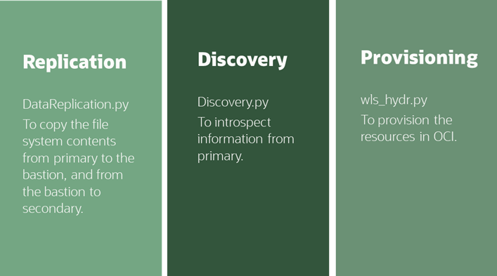

Copyright (c) 2024 Oracle and/or its affiliates
Licensed under the Universal Permissive License v 1.0 as shown at https://oss.oracle.com/licenses/upl/

WLS_HYDR FRAMEWORK
==================================================
This framework **creates and configures a symmetric Disaster Recovery system in Oracle's Cloud (Oracle Cloud Infrastructure-OCI)** for an existing Oracle WebLogic domain environment that follows the [Enterprise Deployment Guide](https://docs.oracle.com/en/middleware/fusion-middleware/12.2.1.4/soedg/enterprise-deployment-overview.html) best practices. The framework implements the procedure described in these playbooks:
- https://docs.oracle.com/en/solutions/weblogic-server-dr-on-cloud/index.html 
- https://docs.oracle.com/en/solutions/soa-dr-on-cloud/index.html

What the framework **DOES**:
-	It creates and configures a secondary environment in OCI (the compute instances for the mid-tier and the web-tier, the OCI Load Balancer, the private and shared storage artifacts, the network resources, etc.), based on a combination of user inputs and information automatically discovered in the  primary system. To get the complete list of the resources that this framework creates, see the point [LIST OF THE RESOURCES](#list-of-the-resources). 
-	It copies binaries and configuration (Oracle products' installations, Oracle HTTP Server and Oracle WebLogic domain configuration) from the primary hosts to the OCI compute instances.
-	It prepares the system for an ongoing replication of configuration and binaries (with different cycles as needed) so that the primary and secondary systems evolve as exact mirrors of each other.

What the framework **DOES NOT DO**:
-	It doesn’t create the secondary system's database in OCI nor configures Oracle Data Guard between the primary and the OCI database. Since the Database can be shared by multiple midtier systems, a separate framework is provided for that tier. Please refer to https://docs.oracle.com/en/solutions/configure-standby-db/index.html for more details on this.
-	It doesn’t configure connectivity between the primary system and the OCI one (typically a FastConnect link, a VPN or a Peered Gateway).

Although the framework's main use case is configuring a hybrid disaster protection system (referred to as "**COMPLETE HYBRID DR SETUP**"), it can be used in additional scenarios:
 - **MIGRATION USE CASE**: The framework can be used to migrate a primary (typically on-premises) WebLogic domain environment to OCI. In this scenario, an existing system is "copied" to OCI but not necessarily to create a "regularly synchronized" standby. In such a use case, the framework performs all the Hybrid DR set up but without establishing ongoing synchronizations. Once the OCI environment is set up, it is used/started as a new primary. The set up, considerations and restrictions for this use case are the same as for the "COMPLETE HYBRID DR SETUP". Only the posterior use of the system varies.
 - **MIGRATION FROM COPY USE CASE**: The MIGRATION USE CASE can also be done "FROM COPY". In this use case, direct connectivity between the on-premises or primary datacenter and OCI is not needed. You upload the binary and configuration contents from primary to the OCI bastion file system and provide the required input properties (in the framework's configuration files) to create OCI resources. Once the OCI environment is set up, it is used/started as a new primary.
- **INFRASTRUCTURE CREATION USE CASE**: The framework can also be used to create the infrastructure required by an EDG environment in OCI without a primary system as a reference. In this use case, there is no discovery of resources in a primary system: you provide all the required input properties to create the OCI resources. There is obviously no replication phase in this scenario either (copy of binaries and configuration from primary to secondary). You run the framework to create infrastructure resources in OCI and then install Oracle products and configure the WebLogic domain manually. In this use case, the WLS_HYDR framework only creates the  OCI artifacts that you need for a WebLogic EDG-like system in OCI: compute instances for WebLogic and for OHS, storage artifacts, OCI Load Balancer, network infrastructure and security rules for the subnets in the VCN.

## Topology Diagram
The following diagram shows a typical Hybrid Disaster Recover topology for an Oracle WebLogic Server system.

This framework provisions and configures the components highlighted in green. 

A **bastion node** is used in Oracle's Cloud to run the framework. When used for the "COMPLETE HYBRID DR SETUP", the bastion connects to primary and creates the secondary system. It then replicates primary's configuration and binaries to the secondary. In the "MIGRATION FROM COPY" use case, the bastion receives a "copy" of the artifacts from the primary system in a precise directory structure. It then creates the secondary system using information in this copy. When used only for the creation of the infrastructure required by an Enteprise Deployment on OCI, the bastion is used simply to initiate and orchestrate the creation of resources in the Cloud.

 

> (*) FastConnect provides a dedicated connection between an on-premises data center and Oracle Cloud Infrastructure and is the preferred connectivity solution for Oracle Data Guard between an on-premises Oracle Database and the OCI standby database. Alternatively, you can use Site-to-Site VPN as long as it meets the bandwidth and latency needs for the Weblogic domain and database replication.  
> The tool uses this connectivity to establish a SSH connections from the bastion host to the primary hosts both in the initial setup and for the ongoing replication of binaries and configuration.
> As explained, in the "MIGRATION FROM COPY" and "INFRASTRUCTURE CREATION" scenarios it is not required to establish a FastConnect or Site-to-Site VPN connection. In these cases, you use this tool (without connectivity to primary) to replicate from a copy in the bastion host or just to create resources in OCI.

## Preparation and Requirements
Your system must meet the following requirements to use the WLS_HYDR framework:
-   A compartment in your OCI tenancy must exist already.
-	A Virtual Cloud Network (VCN) for the OCI resources must exist already. It is expected (but not mandatory) that, if the system uses a database, the database will be in the same VCN and set up before the midtier (if the WLS domain uses JDBC persistent stores, the database must be available before the secondary domain is started).
-	An OCI Linux OEL8 or OEL9 bastion host must exist in the same VCN as the OCI secondary system. Alternatively, if the bastion host isn’t located in the same VCN as the secondary's OCI resources, OCI's VCN local peering must be configured in advance between the bastion's VCN and the secondary system's VCN  (refer to the [OCI documentation](https://docs.oracle.com/en-us/iaas/Content/Network/Tasks/VCNpeering.htm) for this operation). 
-	In the "COMPLETE HYBRID DR SETUP" use case, connectivity is required between the OCI bastion host and the primary hosts.  On-premises and OCI networks can be interconnected with [Oracle Cloud Infrastructure FastConnect](https://docs.oracle.com/en-us/iaas/Content/Network/Concepts/fastconnectoverview.htm#FastConnect_Overview) (preferred) or Site-to-Site VPN. In an "OCI to OCI" setup, [remote peering](https://docs.oracle.com/en-us/iaas/Content/Network/Tasks/scenario_e.htm#scenario_e) between the two systems has to be configured.
-	Direct SSH access is required from the bastion host to the primary OHS and WLS hosts using the owner OS user (e.g. "oracle"). The SSH authentication must use an SSH key. Password-based Authentication is not supported by the framework. 
> NOTE: Connectivity and direct SSH access are required for the initial replication and discovery phases. As explained in the "MIGRATION FROM COPY" use case, you can manually upload the primary's file systems contents to the bastion host, skip the discovery phase, and use the tool to perform the rest of the actions. 
-	The Operating System versions supported for the primary hosts are OEL7.X, OEL8.x, RHEL7.x and RHEL8.x. If the primary hosts are OEL7 or RHEL7, then the compute instances in OCI will be created with OEL7 image. If the primary hosts are OEL8 or RHEL8, then the compute instances in OCI will be created with OEL8 image.
-	By default and following the Enterprise Deployment Guide best practices, Oracle HTTP Servers (OHS) are used to route requests to the WebLogic Servers. If OHS is not used, the framework can be configured to skip its configuration.
-	A Load Balancer is used in front of the OHS hosts. It is expected that this LBR uses a SSL listener for the exposed applications.It's SSL certificate (public and private key files) must be available and transferred to the bastion node (will be used to configure the OCI load balancer).
-	At least 2 nodes for OHS and 2 nodes for WLS are used in primary (minimum High availability). 
-   This framework cannot be used to setup asymetric DR topologies. i.e. it will always set up in secondary the same number of nodes as in primary.
-	The components (WebLogic Servers, OHS instances) do not use IPs as listen addresses. All listeners in any of the components use standard hostnames and not IPs.
-	The system is accessed using frontend host names (a.k.a vanity urls). i.e. the WebLogic applications are accessed through the Load Balancer Virtual Server host names and not IPs.
-	If the WebLogic domain uses an Oracle Database, the appropriate database needs to be configured as standby in OCI. This Data Guard setup can be done before or after running this framework. Refer to the steps at https://docs.oracle.com/en/solutions/configure-standby-db/index.html. This midtier framework does not set up connectivity between the middle tier and the database in OCI.

## Default configuration assumptions
In it's default configuration the WLS_HYDR framework assumes that:
-	SSL is terminated in the front end Load Balanacer.
-   The OHS servers use one virtual host for HTTPS external access to the applications exposed by the WLS domain.
-	(Optional) The OHS servers use a dedicated virtual host for HTTP access to the WLS Admin console.
-	(Optional) The OHS servers use an additional virtual host for HTTP internal access (for example to access to Web Services Manager or other sub-systems that are not exposed to the public internet).
-   The OHS virtual host configuration resides under the "ohs_instance_config/moduleconf" folder.
-	The same SSH key is used to connect to all the on-premises OHS nodes with the user that owns the OHS installation (e.g. "oracle").
-	The same SSH key is used to connect to all the on-premises WLS nodes with the user that owns the WLS/FMW installation  (e.g. "oracle".
-   Every WebLogic Server, including the Admin Server, uses a precise hostname as listen address. i.e. the listen address is not blank nor an IP.
-	There is a single WebLogic Managed Servers' listen address per host in the WebLogic domain. This address may resolve to a different IP from the one provided for the SSH access. i.e. all WebLogic Managed servers in node "A" in a domain use the same hostname for their listen addresses (different port). The Admin Server, however, can listen on other/additional virtual hostname (VHN mapping to a VIP). These VHN and VIP must be manually configured in secondary after running the framework. This is the recommended approach for and Enterprise Deployment (where the Admin Server can failover across nodes in the domain). 
-	The nodes in the Weblogic domain have access to the domain shared config folder (used to failover the Admin Server).
-	There is one WebLogic domain configuration folder private to each WebLogic host. This directory does not reside directly in the boot volume /. Using the boot volume in primary for storing the domain config is supported by the framework also, although not recommended. Refer to [ABOUT TOPOLOGY VARIATIONS](#about-topology-variations). Each private domain configuration folder can be an NFS private mount or a Block Volume, mounted individually in each host in the WLS domain.
-	The Oracle products installations in the WebLogic hosts do not reside in the boot volume /. Using boot volume in primary for storing binaries is supported by the framework also, although not recommended. Refer to [ABOUT TOPOLOGY VARIATIONS](#about-topology-variations). By default, the WLS_HYDR framework assumes that there are 2 redundant shared binary homes (NFS) in primary: one mounted by half of the nodes and the other mounted by the other half. This is the configuration recommended by the Enteprise Deployment Guide and is also the storage topology that is created in OCI.
-	A TNS alias is used in the database connection strings of the primary WebLogic's datasources. TNS alias can be configured before the execution of the Hybrid DR framework. Using TNS alias is recommended even without DR in the picture. Refer to Database Considerations in the Oracle FMW DR Guide for details (https://docs.oracle.com/en/middleware/fusion-middleware/12.2.1.4/asdrg/design-considerations.html#GUID-0E63F5EB-A42F-45CC-9546-BF0D139B4BB8)
-   The WebLogic Administration Server runs collocated with managed servers in one of the hosts.

See the section below [ABOUT TOPOLOGY VARIATIONS](#about-topology-variations) for non-default configurations and how to use this framework with them.

Users and roles required
--------------------------------------
This solution requires the following services and roles:

| Service Name: Role                             | Required to...                                                                                                                                         |
|------------------------------------------------|--------------------------------------------------------------------------------------------------------------------------------------------------------|
| Oracle Cloud Infrastructure: administrator     | Create the required resources in the OCI tenancy with the tool (compute instances, storage, Load Balancer, networking resources)                       |
| Network: administrator                         | Configure the required network resources both in on-premises and OCI: Fast Connect, VCNs and subnets in OCI, network security rules and routing rules. |
| Oracle WebLogic Server: root, oracle           | Use the tool to configure the secondary hosts: OS level configuration, add host aliases, mount file systems, and replication.    |
| Oracle WebLogic Server: Weblogic Administrator | Manage Oracle WebLogic Server: stop, start, and apply WebLogic configuration changes.                                                                  |
| Oracle HTTP Server: root, oracle               | Use the tool to configure the secondary OHS hosts: perform the OS level configuration, add host aliases, mount file systems, and replication.    |

FRAMEWORK OVERVIEW
==================================================
The WLS_HYDR framework consists of three main components:  
 

|What|Description
|---|---|
|wls-hydr|Basedir|
|├── config|Directory where sysconfig.json files are saved|
|├── lib|Lib directory where class files and template files are located|
|│   ├── Logger.py| Logger class file. Handles logging|
|│   ├── OciManager.py| OCI manager class file. Imported by wls_hydr.py and used to interact with OCI|
|│   ├── Utils.py|Various utility functions required by wls_hydr.py (eg data validation functions)|
|│   └── templates|Script templates directory. These are parameterized scripts that are processed by wls_hydr.py with dynamic data. Output scripts will be stored in lib/|
|│       ├── ohs_node_init.sh|Template script for OHS. Processed by wls_hydr.py with OHS information and handles matching OHS UIDs and GIDs with on-prem ones and opening required ports| 
|│       └── wls_node_init.sh|Template script for WLS. Processed by wls_hydr.py with WLS information and handles matching WLS UIDs and GIDs with on-prem ones, opening required ports and mounting filesystems| 
|├── log|Execution logs will be stored here|
|└── wls_hydr.py|Main script|

END-TO-END PROCEDURE
==================================================
- "COMPLETE HYBRID DR SETUP": The following diagram summarizes the main flow execution of the framework. This procedure creates a secondary system in OCI for a given primary based on the EDG best practices. The phases are run individually but the execution of each one depends on the results of the previous one for end to end automation.

Additional scenarios that can take advantage of this framework:

- "MIGRATION USE CASE": The flow of execution is exactly the same as for the "COMPLETE HYBRID DR SETUP". Only the posterior steps after the initial configuration defer: the system is "switched over" to secondary and primary is decomissioned for the production workloads.

- "MIGRATION FROM COPY": To migrate a primary system. There is no connectivity between OCI bastion and primary's hosts. You can't run the pull and discovery phases in this case:

- "INFRASTRUCTURE CREATION": To create the resources in OCI without having any primary environment as reference. You only need to prepare and run the provisioning phase.

## Preparing the system for executing the WLS_HYDR framework
Run the following steps as preparation for the execution of the required scripts:

1. Create the Virtual Cloud Network (VCN) for the resources in OCI in the region where you want to create the resources.
2. Create a subnet in the VCN for the bastion. 
3. Provision a bastion host in the subnet. The bastion host must use OEL8 or OEL9. A "VM.Standard.E4.Flex with 1 OCPU and 16GB memory" shape is enough to run the framework. The amount of information that is copied to the bastion can be high (around 40GB for the typical FMW SOA Product and Config directories), so you can attach an additional block volume of this size during the bastion creation process itself. You can use this formula for a rough estimate of the required storage size: _[2xFMW products] + [WLS_domain_size x (nº wls nodes + 1)] + [2xOHS products] + [OHS domain_size x (nº of OHS nodes)]_
4. For the "COMPLETE HYBRID DR SETUP" use case setup connectivity between primary hosts and bastion host (FastConnect, VPN, Peering).
5. Prepare the bastion host to run the framework:
    1. Make sure the following python modules are installed:  
    oci sdk (this package should come pre-installed on OCI OL9 images):  `rpm -qa | grep -i python.*oci `   
    paramiko:     `rpm -qa | grep -i python3-paramiko`   
    Install with the following command if missing:  
    `sudo yum --enablerepo="ol9_developer_EPEL" install python3-paramiko`  
    or  
    `sudo yum --enablerepo="ol8_developer_EPEL" install python3-paramiko`
    2. Add the OCI config to the bastion server. This is needed to connect with OCI API to the OCI tenancy and region where you want to create the resources. The complete instructions can be found [here](https://docs.oracle.com/en-us/iaas/Content/API/Concepts/apisigningkey.htm#apisigningkey_topic_How_to_Generate_an_API_Signing_Key_Console). Then, when you run the provision phase, you can supply the path of the oci config file using -c/--oci-config FILE_PATH. If no path is supplied, the default path is assumed `<HOME>/.oci/config` 
7. Download the WLS_HYDR framework to the bastion server (example location <HOME>/wls_hydr) 
8. (Optional) Create a subnet for the database.
9. (Optional) Create a DB system and configure Oracle Data Guard between the primary and the OCI DB. You can do this before or after executing the framework (refer to https://docs.oracle.com/en/solutions/configure-standby-db/index.html).

## Pull (initial replication from primary)
### Using the framework
In the initial pull step, the file system contents from the primary hosts are copied to an stage folder in the bastion host. You provide, in the _prem.env_ configuration file, the connection details to the primary hosts and the folders names (nodes IPs, users etc. Then, the tool copies the contents from the OHS and the WebLogic hosts to the bastion node. In the next phases, the tool will introspect this information and push it to the OCI compute instances once they are created.

- Prepare: 
    - Prepare the stage folder in the bastion. If you don't have enough disk space for the copies, you can create an OCI FSS or a new block volume and mount it on the bastion.
    - Edit the `<WLS-HYDR_BASE>/config/prem.env` and provide the values used by your system (the file contains a description of each entry).
    - Edit the _replication.properties_ file and provide the values for the folders as they are in primary (the file contains a description of each entry).

- Run the replication script:
    - `<WLS-HYDR_BASE>/lib/DataReplication.py pull`
- Validate results:
    - Verify the output log (under wls-hydr/log).
    - Verify that the configuration and binaries directories in primary are present in the bastion's stage folder.

The following table summarizes how each item is copied to the stage folder.

| Item    | Pull | Location of the copy under the STAGE_GOLD_COPY_BASE folder |
| -------- | ------- | ------- |
| OHS_PRODUCTS | Regardless the number of OHS nodes, it performs just 2 copies (one copy from OHS node 1 and another copy from OHS node 2). This is doen to provide redundancy and minimize storage size.  |  webtier/ohs_products_home/ohs_products_home1  webtier/ohs_products_home/ohs_products_home2  |
| OHS_PRIVATE_CONFIG_DIR   | One copy per OHS node.    |  webtier/ohs_private_config/ohsnodeN_private_config  |
| WLS_PRODUCTS  | Regardless the number of WLS nodes, it performs 2 copies (one from node 1 and other from node 2). This approach provides redundancy and minimizea storage size. It is valid for cases where redundant shared products folders are used and for cases where each node has private products folder |  midtier/wls_products_home/wls_products_home1  midtier/wls_products_home/wls_products_home2  |
| WLS_PRIVATE_CONFIG_DIR    | One copy from per WLS node.     |  midtier/wls_private_config/wlsnodeN_private_config/  |
| WLS_SHARED_CONFIG_DIR | It is assumed that this shared folder could contain external content from other environments. So only these subfolders are copied:  - the domain home  - the applications home (where the em.ear file resides).  These items are copied only from the first node, as this is expected to be a shared folder. |  appropriate subfolders under midtier/wls_shared_config/  |
| WLS_SHARED_RUNTIME_DIR    | **The content in this folder is not copied**. The value is used only to prepare the storage mount in OCI.    |  N/A  |
| WLS_CONFIG_PATH    | The location of the config.xml file. The tool gathers the domain home and applications home from this file    |  N/A  |
| WLS_DP_DIR    | Copied only from the first WLS node. Assumed it is shared.     |  appropriate subfolder under midtier/wls_shared_config  |
| WLS_ADDITIONAL_SHARED_DIRS    | Additional shared dirs that need to be copied. They are copied from node 1    |  The complete path is stored under midtier/wls_shared_config/additional_dirs/  |

### Manual copy
If you don't have SSH connectivity between the bastion to the on-premises hosts, you can manually copy the items to the bastion's stage folder. In this case you must honor the following staging directory structure:

├── midtier

│   ├── var

│   │   └── tnsnames.ora

│   ├── wls_private_config

│   │   ├── wlsnode1_private_config

│   │   └── wlsnode2_private_config

│   │   └── (.. N, according to number of WLS nodes in primary)

│   ├── wls_products_home

│   │   ├── wls_products_home1

│   │   └── wls_products_home2

│   └── wls_shared_config

│   │   ├── additional_dirs

│   │   ├── applications

│   │   ├── domains

│   │   └── dp

└── webtier

│   ├── ohs_private_config

│   │   ├── ohsnode1_private_config

│   │   └── ohsnode2_private_config

│   │   └── (.. N, according to number of OHS nodes in primary)

│   ├── ohs_products_home (only two irrespectively of additional OHS nodes)

│   │   ├── ohs_products_home1

│   │   └── ohs_products_home2

## Discovery
As part of the discovery phase process, the tool automatically finds relevant information of the system. It obtains this information in two ways: by introspecting the pulled information and by connecting via SSH to the primary hosts. It will use this information to create the resources in OCI in the next phases.
- Prepare:
    - Edit `<WLS-HYDR_BASE>/config/prem.env`. If you ran the pull replication phase, this file should be already customized.
- Run:
    - `<WLS-HYDR_BASE>/lib/Discovery.py`
- Validate:
    - The discovery tool stores the results in the output file `<WLS-HYDR_BASE>/config/discovery_results.csv`. Review the file and check that the entries are correct for your environment.
    - If needed, you can re-run  discovery. The output file will be overriden with the new results.

## Provision in OCI 
In the provisioning phase, the tool creates the resources in OCI. They are created according to the input properties provided by the user and the results obtained in the discovery phase. 
- Prepare:
    - If you have run the discovery phase, then you need to complete a few pending entries (those that are not already populated by discovery) in the excel file _sysconfig_discovery.xlsx_.
    - If have have NOT run the discovery phase, then you need to complete the entries provided in the excel file _sysconfig.xlsx_.
    - Export the excel to .CSV format and upload it to the bastion.
    - Upload the keys and certs files of the LBR to the bastion. Place them in the appropriate path, according with the inputs in the _sysconfig_ spreadsheet.
- Run:
    - If you have run the discovery phase, execute the main script using the "-a" flag and provide the exported csv file as parameter: 
    `<WLS-HYDR_BASE>/wls_hydr.py -i <XXX_discovery.csv> -a`
    - If you have NOT run discovery, execute the main script by just providing the exported csv:
    `<WLS-HYDR_BASE>/wls_hydr.py -i <XXX.csv>`
- Validate results:
    - Verify that the appropriate OCI resources have been created. To get the complete list of the resources, [see the LIST OF THE RESOURCES](#list-of-the-resources).

## Push (initial replication to OCI)
In the push phase, the tool copies the contents from the bastion stage to the OCI compute instances. The following table describes how each item is copied to the OCI hosts.
| Item    | Location of the copy under the STAGE_GOLD_COPY_BASE folder  | Push|
| -------- | ------- | ------- |
| OHS_PRODUCTS | webtier/ohs_products_home/ohs_products_home1  webtier/ohs_products_home/ohs_products_home2  | The ohs_products_home1 is copied to all odd nodes, the ohs_products_home2 is copied to all even nodes  |  
| OHS_PRIVATE_CONFIG_DIR   | webtier/ohs_private_config/ohsnodeN_private_config  |  Each node's is copied to each OHS peer node.    |
| WLS_PRODUCTS  |  midtier/wls_products_home/wls_products_home1  midtier/wls_products_home/wls_products_home2  |  The wls_products_home1 is copied to node 1, the wls_products_home2 is copied to node 2. If there are more WLS nodes, they share the same products folder in a odd/even distribution  |
| WLS_PRIVATE_CONFIG_DIR     |  midtier/wls_private_config/wlsnodeN_private_config/  | Each node copy to each WLS peer node. |
| WLS_SHARED_CONFIG_DIR |   appropriate subfolders under midtier/wls_shared_config/  | The domain and applications homes (where the em.ear file resides) are copied to the first OCI WLS node on a shared folder. |
| WLS_SHARED_RUNTIME_DIR    |  N/A  | The content in this folder is not copied.   |
| WLS_DP_DIR    |  appropriate subfolder under midtier/wls_shared_config  | Copied only to the first WLS node. Assumed it is shared.     |
| WLS_ADDITIONAL_SHARED_DIRS    | The complete path is stored under midtier/wls_shared_config/additional_dirs/    |  Copied only to the first WLS node. Assumed it is shared.  |

- Prepare:
    - verify the `<WLS-HYDR_BASE>/config/oci.env` file. This file is pre-populated in the provisioning phase, so just verify that the values are accurate.
- Run:
    - `<WLS-HYDR_BASE>/lib/DataReplication.py push`
- Validate results:
    - Verify the output.
    - Verify that the contents are present in the expected locations in the OCI hosts.

## Push tnsnames.ora 
In this step, the tool retrieves the tnsnames.ora file from on-premises domain, it performs a replacement of the scan address and service name to point to the secondary database, and it copies the new file to the OCI WebLogic hosts. The tnsnames.ora file is skipped from the regular pull and push replications, because this file is different in each site (the entry in the tnsnames.ora must point to the local database in each site). Hence, this replication action is needed only during the initial setup. 
- Prepare:
    - Verify that the section "JDBC" in the file `<WLS-HYDR_BASE>/config/replication.properties` contains the appropriate values.
- Run:
    - `<WLS-HYDR_BASE>/lib/DataReplication.py tnsnames`
- Validate:
    - Verify that the tnsnames.ora file exists in the appropriate path in the OCI WebLogic hosts. 
    - Verify that its content is correct.

## Replication during lifecycle

Ongoing replication can be stablished between primary and secondary to maintain both in sync. You can cron the copy at regular intervals in the bastion node. (TBA)

ABOUT TOPOLOGY VARIATIONS 
==================================================
The following sections describe topology variations from the default Enterprise Deployment recommendations. Although these variations are supported they may require additional cofiguration and customizations in the framework.

#### 1. Not using a shared config folder for the wls domain (wls using only folders private to each node)
In this scenario, the WebLogic Administration server does not use a separate domain directory on a shared storage. Instead all servers run from domain directories that are private to each node and in the first node this directory is shared by the Administration Server and the managed servers on that same node. To support this use case, leave the WLS_SHARED_CONFIG_DIR value in the _replication.properties_ file empty. Provide a value for WLS_PRIVATE_CONFIG_DIR. This will be used as the domain directory in all nodes and will  host also the Admin Server's domain directory.

#### 2. The private wls config is not in a separate mount point, it resides in a subfolder in the boot volume / 
In this scenario the WLS nodes do not use a separate volume/mount for the WLS private config: they store it in the boot volume. For example, private config folder is /u02/oracle/config, but it resides under the / mount. Since this approach goes against High Availability best practices, the framework will still create separate block volumes for the domain configuraiton while preserving the required paths. Depending on the type of operation, different configuration options must be provided:
- When using the framework for the "COMPLETE HYBRID DR SETUP", the framework will detect "/" as mount point (i.e. using boot volume) and will use the value of WLS_PRIVATE_CONFIG_DIR as the mount point to be created in OCI (as specified in the _replication.properties_ file)
- When using the framework for the "MIGRATION FROM COPY" or for the "INFRASTRUCTURE CREATION" use cases: the user will have to provide all the values in the _sysconfig_ spreadsheet file specifying the path under which the domain directory resides (for example, /u02/oracle/config). 

#### 3. The wls products folder is not in a separate mount point, it resides in a subfolder in the boot volume / 
In this scenario the WLS nodes do not use a separate volume/mount for the WLS product installation: they store it in the boot volume. For example, the installation folder is /u02/oracle/products, but it resides under the / mount. Since this approach goes against High Availability best practices, the framework will still create separate block volumes for the products' binaries while preserving the required paths. Depending on the type of operation, different configuration options must be provided:
- When using the framework for the "COMPLETE HYBRID DR SETUP", the framework will detect "/" as mount point (i.e. using boot volume) and will use the value of WLS_PRODUCTS  as the mount point to be created in OCI (as specified in the _replication.properties_ file)
- When using the framework for the "MIGRATION FROM COPY" or for the "INFRASTRUCTURE CREATION" use cases: the user will have to provide all the "Products mountpoint" entry in the _sysconfig_ spreadsheet file specifying the path for the binary/install directory. 

#### 4. Each node uses its own/private products home
In this scneario, each WLS node has its own wls/fmw installation. The Hybrid DR setup wil proceed without any specific configuration being required. Subsequent binary updates (patches) happen less frequently than config changes. They can be propagated separately if nodes are patched.

#### 5. Not using OHS (LBR connects directly to WLS)
In this scenario, Oracle HTTP server (OHS) is not used and the LBR routes requests directly to the backend WLS servers. The OHS nodes' IP values need to be left empty in the _prem.env_ configuration file. No actions related to OHS are performed by the framework (no discovery for OHS, no provision of the OHS related resources, etc). The tool creates an LBR with a minimal config (no listener and no backends). It is required to complete the LBR config AFTER using the wls_hydr framework. This can be done in the OCI Console or using terrform/apis. An example is provided at https://github.com/oracle-samples/maa/tree/main/hybrid_dr/hybrid_dr_terraform/common/HybridDR_OCILoadBalancer).

#### 6. The WLS Admin Console or applications that are exposed only internally, use their own OHS virtual host
This is the case when the WebLogic Admin Console and FMW Control are accessed using its own virtual host in OHS and front end LBR virtual servers. Or when some applications are only accesed internally through a different virtual Host and LBR listener (as it is the case for WSMPM in SOA domains, for example) To address this scenario provide the "Internal virtual host" and "Virtual host for WebLogic Admin Console" entries indicated in the sysconfig spreadsheet (they are marked as optional).

#### 7. The WLS Admin Console is exposed on HTTPS instead of HTTP
In this case the WLS_HYDR framework will create an HTTP listener and the user will have to update it manually to use HTTPs.

#### 8. The topology is using an HTTP server differnet from OHS
In this case, use the tool as prescribed in variation #5 and then manually configure the LBR, the HTTP server nodes and the HTTP server itself.

KNOWN ISSUES/ OTHER LIMITATIONS
==================================================

1. Using more than one HOSTNAME as listen address for managed servers in the same host in the Weblogic domain is not supported by the WLS_HYDR framework in this release (other than the Admin Server's listen address).
2. Using more than one Virtual Host for applications to be exposed through the LBR and OHS is not supported by the WLS_HYDR framework in this release.
3. Having the WebLogic Admin Server running in its own/separate host is not supported by the WLS_HYDR framework in this release.
4. Using other OS versions than OEL7,OEL8,RHEL7,RHEL8 in primary is not supported by the WLS_HYDR framework in this release.
5. Systems not using a front end LBR and using OHS instead as front end are not supported by the WLS_HYDR framework in this release.

LIST OF THE RESOURCES
==================================================
This table lists all the resources that this framework creates in OCI.

Click to expand

| Category                     | Resource                                                    | Name                                       | Additional details                                                                |
|------------------------------|-------------------------------------------------------------|--------------------------------------------|-----------------------------------------------------------------------------------|
| Network resources            | subnet for webtier                                          | custom name                                | Created if it doesn't already exist                                               |
|                              | subnet for midtier                                          | custom name                                | Created if it doesn't already exist                                               |
|                              | subnet for FSS                                              | custom name                                | Created if it doesn't already exist                                               |
|                              | subnet for dbtier                                           | custom name                                | Created if it doesn't already exist                                               |
|                              | private route table                                         | HyDR_private_subnet_route_table            |                                                                                   |
|                              | public route table                                          | HyDR_public_subnet_route_table             | Created if there is a public subnet                          |
|                              | security list for webtier subnet                            | \<webtier_subnet_name\>_security_list        |                                                                                   |
|                              | security list for midtier subnet                            | \<midtier_subnet_name\>_security_list        |                                                                                   |
|                              | secuirty list for FSS tier subnet                           | \<fsstier_subnet_name\>_security_list        |                                                                                   |
|                              | security list for dbtier subnet                             | \<dbtier_subnet_name\>_security_list         |                                                                                   |
|                              | Internet Gateway                                            | HyDR_SG_Gateway                            | Created if it doesn't exist and there is a public subnet                          |
|                              | Service Gateway                                             | HyDR_SG_Gateway                            | Created if it doesn't already exist                                               |
|                              | NAT Gateway                                                 | HyDR_NAT_Gateway                           | Created if it doesn't already exist                                               |
|                              | DNS Private View                                                | HYBRID_DR_VIRTUAL_HOSTNAMES                |                                                                                   |
|                              | DHCP Options                                                | HyDR-DHCP                                  |                                                                                   |
|                              | Virtual IP Address for AS **(TBD)**                             | \<the listen address of the Admin Server\>   | Created only if AS listens in a VIP                                               |
| Compute Instances            | N compute instances for OHS                                 | \<custom ohs prefix\>-N                      | Created using WLS for OCI images                                                  |
|                              | N compute instances for WLS                                 | \<custom wls prefix\>-N                      | Created using WLS for OCI images                                                  |
| Storage Resources            | FSS Mount target                                            | \<custom_prefix\>Target1 (2)                 | 1 (or 2 if using 2 availability domains).                                         |
|                              | FSS File System for WLS shared config                       | \<custom_prefix\>configFSS                   |                                                                                   |
|                              | FSS File System for WLS products 1                          | \<custom_prefix\>productsFSS1                |                                                                                   |
|                              | FSS File System for WLS products 2                          | \<custom_prefix\>productsFSS2                |                                                                                   |
|                              | FSS File System for WLS shared runtime                      | <\<ustom_prefix\>runtimeFSS                  |                                                                                   |
|                              | N Block Volumes                                             | wlsdrbvN                                   | One per WLS node, for the private config                                          |
| Load Balancer resources      | Load Balancer                                               | custom name                                |                                                                                   |
|                              | Ruleset                                                     | HTTP_to_HTTPS_redirect                     |                                                                                   |
|                              | Ruleset                                                     | SSLHeaders                                 |                                                                                   |
|                              | Listener (for HTTPS)                                        | HTTPS_APP_listener                         |                                                                                   |
|                              | Listener (for HTTP)                                         | HTTP_APP_listener                          | In port 80 and same hostname than "Listener (for HTTPS)", redirects all to "Listener (for HTTPS)" |
|                              | Listener (for WLS Admin Console, HTTP)                      | Admin_listener                             |                                                                                   |
|                              | Listener (for internal accesses, HTTTP)                     | HTTP_internal_listener                     | Optional                                                                          |
|                              | Certificate                                                 | HyDR_lbr_cert                              |                                                                                   |
|                              | Hostname (frontend for HTTPS access)                        | HyDR_LBR_virtual_hostname                  |                                                                                   |
|                              | Hostname (frontend for accesing to WLS Admin Console)       | HyDR_LBR_admin_hostname                    | Optional                                                                                  |
|                              | Hostname (frontend for Internal HTTP acccess)               | HyDR_LBR_internal_hostname                 | Optional                                                                          |
|                              | Backendset for the "Listener (for HTTPS)"                   | OHS_HTTP_APP_backendset                    |                                                                                   |
|                              | Backendset for the "Listener (for WLS Admin Console, HTTP)" | OHS_Admin_backendset                       |                                                                                   |
|                              | Beackenset for the "Listener (for HTTP)"                    | empty_backendset                           |                                                                                   |
|                              | Backendset for the Listener (for internal access, HTTP)  | OHS_HTTP_internal_backendset_XX            | Optional                                                                          |
| Additional actions performed | In the OHS compute instances                                    | Create user/group as primary               |                                                                                   |
|                              |                                                             | Configure ssh access for user              |                                                                                   |
|                              |                                                             | Create folders                             |                                                                                   |
|                              |                                                             | Open required ports in OS FW               |                                                                                   |
|                              |                                                             | Add OHS listen addresses to the /etc/hosts |                                                                                   |
|                              |                                                             | Add frontend names to the /etc/hosts       |                                                                                   |
|                              | In the WLS compute instances                                    | Create user/group as primary               |                                                                                   |
|                              |                                                             | Configure ssh access for user              |                                                                                   |
|                              |                                                             | Install package compat-libstdc++-33 if OEL7        |                                                                                   |
|                              |                                                             | Create folders                             |                                                                                   |
|                              |                                                             | Open required ports in OS FW               |                                                                                   |
|                              |                                                             | Mount storage artifacts (FSS and BV)       |                                                                                   |
|                              |                                                             | Add frontend names to the /etc/hosts       |                                                                                   |

LIST OF THE OCI POLICIES REQUIRED
==================================================
This table lists all the required OCI Policies for the user who runs the tool.

Click to expand

"MyGroup" is the group name of the user who will run the tool.   
"MyCompartment" a is the name of the compartment in which the resources will be created.

| Policy                                                                                     | Description                                                             | Policy Location |
|--------------------------------------------------------------------------------------------|-------------------------------------------------------------------------|-----------------|
| Allow group MyGroup to   inspect instance-image in compartment MyCompartment               | To use the WebLogic for OCI images in Marketplace                       | Compartment     |
| Allow group MyGroup to use   app-catalog-listing in compartment MyCompartment              | To use the Marketplace applications catalog                             | Compartment     |
| Allow group MyGroup to manage   instance-family in compartment MyCompartment               | To create Compute Instances                                             | Compartment     |
| Allow group MyGroup to manage   volume-family in compartment MyCompartment                 | To create Block Volumes                                                 | Compartment     |
| Allow group MyGroup to inspect   limits in tenancy                                         | To determine if resources are available in various compartments         | Compartment     |
| Allow group MyGroup to manage   virtual-network-family in compartment MyNetworkCompartment | To create VCNs and subnets                                              | Compartment     |
| Allow group MyGroup to manage   load-balancers in compartment MyNetworkCompartment         | To create a load balancer                                               | Compartment     |
| Allow group MyGroup to manage   mount-targets in compartment MyCompartment                 | To create mount targets and associate file systems to the mount targets | Compartment     |
| Allow group MyGroup to manage   file-systems in compartment MyCompartment                  | To create a shared file system                                          | Compartment     |
| Allow group MyGroup to manage   export-sets in compartment MyCompartment                   | To create export-sets                                                   | Compartment     |
         

                                                                                  

